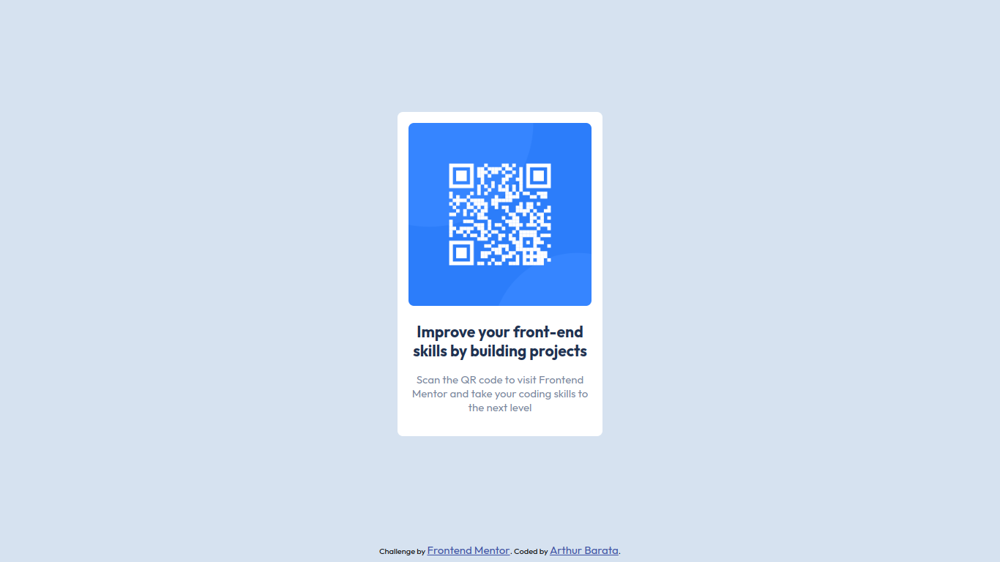

# Frontend Mentor - QR code component solution

This is a solution to the [QR code component challenge on Frontend Mentor](https://www.frontendmentor.io/challenges/qr-code-component-iux_sIO_H). Frontend Mentor challenges help you improve your coding skills by building realistic projects. 

## Table of contents

- [Overview](#overview)
  - [Screenshot](#screenshot)
  - [Links](#links)
- [My process](#my-process)
  - [Built with](#built-with)
  - [What I learned](#what-i-learned)
  - [Continued development](#continued-development)
- [Author](#author)

## Overview

### Screenshot



### Links

- Solution URL: [https://github.com/baratarthur/qr-code-component](https://github.com/baratarthur/qr-code-component)
- Live Site URL: [https://qr-code-component-nine-chi.vercel.app](https://qr-code-component-nine-chi.vercel.app)

## My process

### Built with

- Semantic HTML5 markup
- CSS custom properties
- Flexbox
- Mobile-first workflow

### What I learned

Despite being a simple project without complex features,
I learned a lot about semanthic HTML and css best pratices
by using semanthic tags and tag structure, css variables and
display flex.

Semanthic tags outline:

```html
<main></main>
<section></section>
<header></header>
```

### Continued development

In this project I had the opportunity to pratice semanthic html,
an important tool for every frontend application

## Author

- Website - [https://github.com/baratarthur](https://github.com/baratarthur)
- Frontend Mentor - [@baratarthur](https://www.frontendmentor.io/profile/baratarthur)
